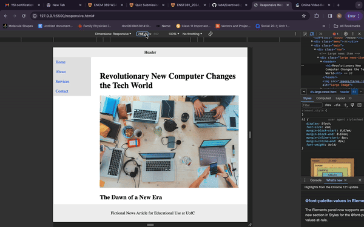

# PROJECT OVERVIEW

- THE PRUPOSE OF THIS PROJECT WAS TO GET FAMILIAR WITH CSS
- RESPONSIVE.HTML WAS TO MAKE CHNAGES WITHOUT USING FLEX
-FLEX.HTML WAS MODIFYING THE FILE USING FLEX

## TEAM MEMBERS
|Name|
______________
|Shivansh Sharma|
|Mohit Narula   |
|               |

## SCREENSHOTS

